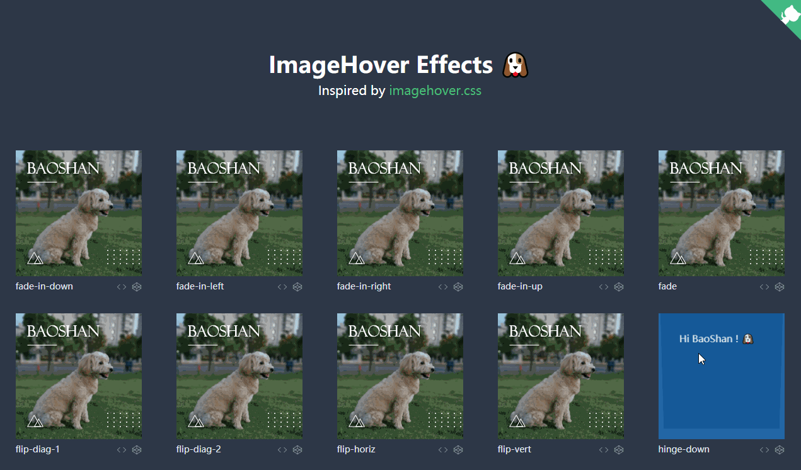

# Image Hover Effects

*No Javascript, a lightweight CSS collection of image hover effects you've always wanted.* [Preview &rarr;](http://turkyden.github.io/image-hover/)

[](http://turkyden.github.io/image-hover/)

English | [简体中文](./README_cn-zh.md)

## Effects

| Category | Name |
| ----- | ----- |
| fade | `fade` `fade-in-up` `fade-in-down` `fade-in-left` `fade-in-right` |
| flip | `flip-diag-1` `flip-diag-2` `flip-horiz` `flip-vert` |
| hinge | `hinge-up` `hinge-down` `hinge-left` `hinge-right` |
| push | `push-up` `push-down` `push-left` `push-right` |
| reveal | `reveal-up` `reveal-down` `reveal-left` `reveal-right` `reveal-top-left` `reveal-top-right` `reveal-bottom-left` `reveal-bottom-right` |
| shutter | `shutter-in-horiz` `shutter-in-vert` `shutter-in-out-horiz` `shutter-in-out-vert` `shutter-in-out-diag-1` `shutter-in-out-diag-2` `shutter-out-diag-1` `shutter-out-diag-2` `shutter-out-horiz` `shutter-out-vert` |
| slide | `slide-up` `slide-down` `slide-left` `slide-right` `slide-top-left` `slide-top-right` `slide-bottom-left` `slide-bottom-right` |

## Contribute

``` npm
npm install
```

### Compiles and hot-reloads for development

``` npm
npm run serve
```

### Compiles and minifies for production

``` npm
npm run build
```

### Lints and fixes files

``` npm
npm run lint
```

### Customize configuration

See [Configuration Reference](https://cli.vuejs.org/config/).

## Browser Support

 |  |  |  |  | 
--- | --- | --- | --- | --- | --- |
Latest ✔ | Latest ✔ | Latest ✔ | 11+ ✔ | Latest ✔ | Latest ✔ |

## LICENSE

MIT
